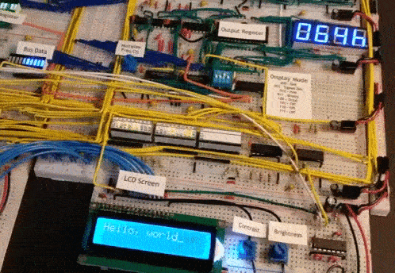

# 8bit-bb-comp
Ben Eater [inspired](https://www.youtube.com/playlist?list=PLowKtXNTBypGqImE405J2565dvjafglHU) 8-bit breadboard computer with extra 7-seg display modes, program ROM, and LCD.

# Demo

  

    

  

# Wire Colors
- Red = +5V
- Black = Ground
- Blue = Bus Connection
- White = Clock
- Orange = Reset
- Yellow = Control Lines
- Green = Misc Signals

# 7-Segment Displays
The displays are multiplexed, i.e. only one digit is illuminated at one time. With a high enough frequency and persistence of vision, it appears that all digits are lit up together. Below you can see this effect at a low frequency.

  

# Fibonacci Sequence
Here, the processor is running a program which computes the first few values of the Fibonacci [sequence](https://en.wikipedia.org/wiki/Fibonacci_number) and sends them to the output register. You can see the values shown in binary and decimal on the output display.

    

# Block Diagram

  

# Control Signals

Signal Name | Description
:---: | :---:
HLT | Halt clock
M1I | Memory address register 1 in (RAM)
RI  | RAM data in
RO  | RAM data out
IO  | Instruction register out
II  | Instruction register in
AI  | A register in
AO  | A register out
EO  | ALU out
SU  | ALU subtract
BI  | B register in
BO  | B register out
OI  | Output register in
CE  | Program counter enable
CO  | Program counter out
J   | Jump (program counter in)
FI  | Flags in
M2I | Memory address register 2 in (ROM)
RMO | ROM data out
LRS | LCD Register Select (Cmd/Data)
LCI | LCD in

# Instruction Set

Instruction | RTL | Description
:---: | :---: | :---:
NOP     |                                       | No Operation
 |  | 
LDA, a  |  ROM[a] -> A                          | Load A from ROM
LDI, d  |  d -> A                               | Load A, Immediate Data
LDR, a  |  RAM[a] -> A                          | Load A from RAM
 |  | 
ADD, a  |  A + ROM[a2] -> A                     | Add ROM data to A
ADI, d  |  A + d -> A                           | Add Immediate data to A
ADR, a  |  A + RAM[a] -> A                      | Add to A from RAM
SUB, a  |  A - ROM[a2] -> A                     | Subtract ROM data from A
SUI, d  |  A - d -> A                           | Subtract Immediate data from A
 |  | 
STA, a  |  A -> RAM[a]                          | Store A in RAM
OUT     |  A -> OUT                             | Transfer A to OUT
LKR, a  |  ROM[RAM[a]] -> A                     | Load A from ROM, using ptr in RAM
OTR, a  |  RAM[a] -> OUT                        | Output from RAM
OTM, d  |  d -> OUT                             | Output, Immediate Data
LBI, d  |  d -> B                               | Load B, Immediate Data
OUA, d  |  d -> A, d -> B, d -> OUT             | Load A, B, OUT, Immediate Data
SRA, a  |  a -> MAR1                            | Set RAM Address
OAL, d  |  d -> A, d -> B, d -> OUT, d-> LCD_D  | Load, A, B, OUT, and LCD Data, Immediate Data
 |  | 
JMP, a  |  a -> PC                              | Jump
JC,  a  |  (CF) : a -> PC                       | Jump if carry set
JZ,  a  |  (ZF) : a -> PC                       | Jump if zero set
 |  | 
DC, d   |  d -> LCD_C                           | Disp Cmd
DD, d   |  d -> LCD_D                           | Disp Data
DCA     |  A -> LCD_C                           | Disp Cmd from A Reg
DDA     |  A -> LCD_D                           | Disp Data from A Reg
DCO, d  |  d -> LCD_C, d -> OUT                 | Disp Cmd + Out, Immediate Data
DDO, d  |  d -> LCD_D, d -> OUT                 | Disp Data + Out, Immediate Data
CAO     |  A -> LCD_C, A -> OUT                 | Disp Cmd from A Reg + Out
DAO     |  A -> LCD_D, A -> OUT                 | Disp Data from A Reg + Out

d  = Immediate Data  
a  = RAM or ROM Address  

# Useful Links
https://www.youtube.com/playlist?list=PLowKtXNTBypGqImE405J2565dvjafglHU  
https://github.com/beneater/eeprom-programmer  
https://www.reddit.com/r/beneater/comments/g2dya8/finally_finished_my_8bit_build/  
https://imgur.com/gallery/4DphJaJ  
